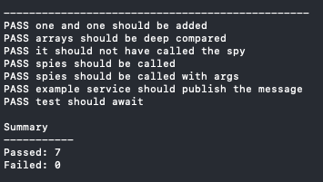

## Microtest

Dead simple async unit test suite for micropython.

This is a work in progress. Mainly using it on side projects and adding to it as needed.
I started this because I wanted to actually run my tests with `micropython` instead
of `python` for more reliability.

## Usage
Just copy `microtest.py` over to wherever you're using it.

You'll need:
- `micropython` installed where you're running the tests (I'm using a Mac)
- the `uasyncio` package installed

Clone this repo and run `make tests`

You can reference `examples.test.py` and the `Makefile` in this repo for tips on
running tests with the `micropython` binary.

I'm also using microtest in [microqueue](https://github.com/rogisolorzano/microqueue)
