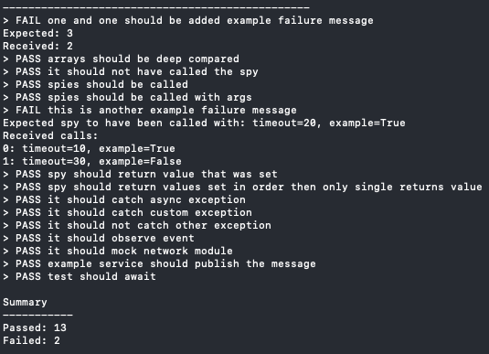

## Microtest

Dead simple async unit test suite for micropython.



## Features:
`@test` decorator for defining tests
```
@test
async def one_and_one_should_be_added():
  expect(1 + 1).to_be(2)
```

Deep assertions
```
expect([1, 's', ('tuple'), {"a": 1}]).to_be([1, 's', ('tuple'), {"a": 1}])
expect([{"a": 1}]).it_not.to_be([{"a": 2}])
```

Spies - asserting on function calls (including support for keyword arguments)
```
  expect(spy_one).to_have_been_called()
  expect(spy_one).to_have_been_called_times(2)
  expect(spy_one).to_have_been_called_with('foo')
  expect(spy_two).to_have_been_called_with(1, param = 2)
```

Defining one return value or a list of values for future calls
```
spy_one = spy().returns(10)
expect(spy_one()).to_be(10)

spy_two = spy().define_returns(10, 20, 30)
expect(spy_two()).to_be(10)
expect(spy_two()).to_be(20)
expect(spy_two()).to_be(30)
```

Asserting on exceptions on async functions and custom exception matching
```
async def boom():
  await uasyncio.sleep_ms(500)
  raise CustomException("Boom")

await expect(boom).to_throw(CustomException)
```

Observing events
```
event = uasyncio.Event()
observer = observe(event)

await some_code_that_should_trigger_event()
await observer.wait()

expect(observer).to_have_been_triggered()
```

Inverse operator on all assertions (`it_not`)
```
expect(1 + 1).it_not.to_be(3)
```

Mocking modules
```
network_mock = NetworkMock()
mock_module('network', network_mock)

from network import hostname

@test
async def it_should_mock_network_module():
  hostname()
  expect(network_mock.hostname).to_have_been_called_times(1)
```

Full async support
```
async def job():
  await uasyncio.sleep(1)
  return 'it works!'

@test
async def test_should_await():
  expect(await job()).to_be('it works!')
```

See `examples.test.py` for full examples.

## Usage
Just copy `microtest.py` over to wherever you're using it.

You'll need:
- `micropython` installed where you're running the tests (I'm using a Mac)
- the `uasyncio` package installed

You can reference `examples.test.py` and the `Makefile` in this repo for tips on
running tests with the `micropython` binary. You can clone this repo and run `make tests`.

Other projects using microtest:
- [pico-w-wlan](https://github.com/rogisolorzano/pico-w-wlan)
- [microqueue](https://github.com/rogisolorzano/microqueue)


This is a work in progress. Mainly using it on side projects and adding to it as needed.
I started this because I wanted to run my tests with `micropython` instead of `python`
for more consistency with the environment where the code runs. I was also looking for
something with better `uasyncio` support.
